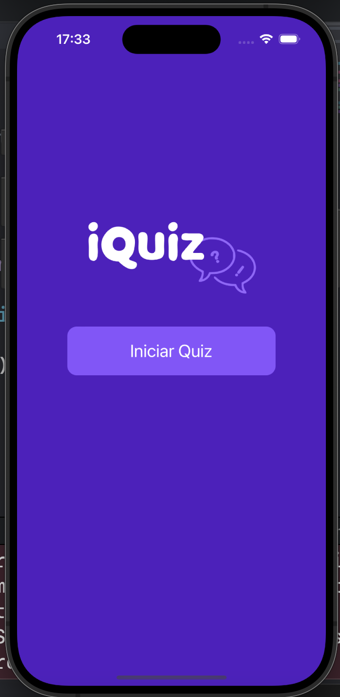
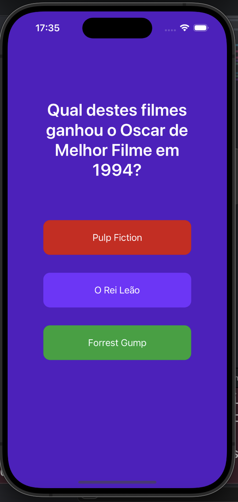
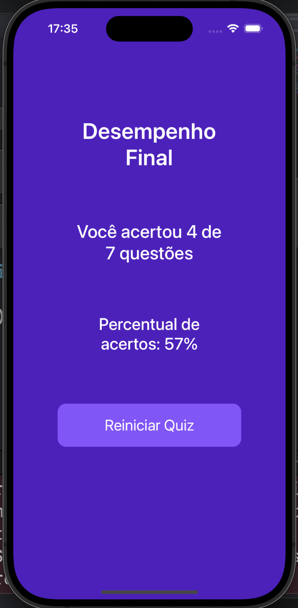

<h1>iQuiz 📱</h1>

<h2>📜 Sobre</h2>

Projeto desenvolvido durante a "Formação Domine a Linguagem Swift" da Alura, com algumas melhorias incrementais que desenvolvi por conta própria.

Basicamente, este aplicativo trata-se de um jogo de perguntas e respostas sobre filmes e séries da cultura pop. Nele, serão apresentadas 7 perguntas por partida, e o jogador poderá escolher 1 entre 3 opções, onde apenas uma delas é a resposta correta.

Ao fim do jogo, será exibida uma tela contendo o desempenho do usuário e um botão para jogar novamente.

<h2>✨ Funcionalidades</h2>
<ul>
  <li>Perguntas mudam a cada partida;</li>
  <li>Indicador de acerto / erro e</li>
  <li>Tela de desempenho final.</li>
</ul>

<h2>💻 Tecnologias</h2>

    
    

<h2>👁️ Preview</h2>

  
  
  
  

<h2>🧑🏻‍💻 Desenvolvido por</h2>

João Faverão
